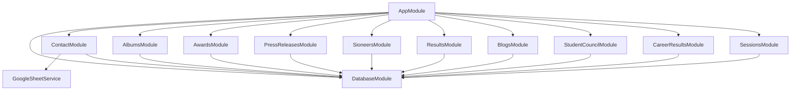
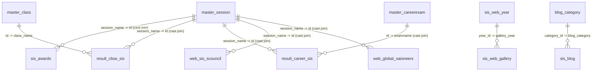
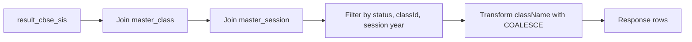
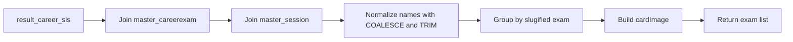
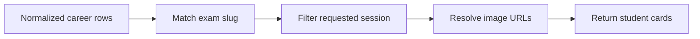
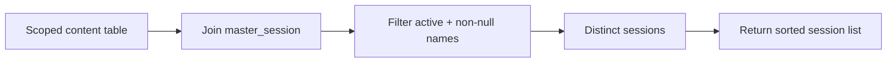
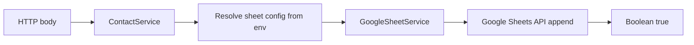

# `sis-backend` Backend API Documentation 
## 1. System Overview

### Purpose of the Application

The application serves as the backend for a school website. It exposes public APIs for:

- albums/gallery browsing
- awards
- blogs
- press releases
- academic results
- career results
- student council listings
- “sioneers” listings
- available academic sessions for UI filters
- contact form submissions
- newsletter subscriptions

### Major Modules

| Module | Purpose |
| --- | --- |
| `AppModule` | Root composition module |
| `DatabaseModule` | Provides shared Kysely MySQL connection |
| `AlbumsModule` | Gallery album listing and album photo retrieval |
| `AwardsModule` | Award listings and latest awards |
| `BlogsModule` | Blog latest/by-year/by-id retrieval |
| `CareerResultsModule` | Career exam list and exam detail data |
| `ContactModule` | Contact form and newsletter submission |
| `PressReleasesModule` | Press release list by year |
| `ResultsModule` | Academic result lookup by year and class |
| `SessionsModule` | Filter-support API returning available sessions by scope |
| `SioneersModule` | Sioneers listing by year |
| `StudentCouncilModule` | Student council listing by year |

### Service Dependencies


## 2. Database Documentation

For the full table-by-table database reference, including the attached `result_cbse_sirs` and `web_sirs_scouncil` table dumps, see [Database Documentation](database.md).

### Database Technology

- Query builder: Kysely
- Driver/dialect: `mysql2` with `MysqlDialect`
- Database engine: MySQL-compatible database

### Table Inventory

| Table | Purpose |
| --- | --- |
| `master_school` | School master data |
| `sis_awards` | Awards content records |
| `result_cbse_sis` | Standard academic results |
| `result_career_sis` | Career exam result records |
| `master_class` | Class metadata |
| `web_sis_pressrelease` | Press release records |
| `web_sis_scouncil` | Student council records |
| `web_global_saioneers` | Sioneers records |
| `sis_web_gallery` | Gallery albums |
| `sis_blog` | Blog records |
| `blog_category` | Blog category metadata |
| `sis_web_year` | Gallery year/category mapping |
| `master_session` | Academic sessions |
| `master_careerexam` | Career exam master data |

### Relationships Overview



### Table Details

#### `master_school`

Purpose: school master data. No active query usage was found in controllers/services.

| Column | Type | Nullable | Description |
| --- | --- | --- | --- |
| `id` | `number` | No | Primary identifier |
| `school_name` | `string` | No | School name |
| `school_address` | `string` | No | School address |
| `status` | `string` | No | School status |

Relationships:

- No active runtime joins found.

#### `sis_awards`

Purpose: stores award records returned by awards endpoints.

| Column | Type | Nullable | Description |
| --- | --- | --- | --- |
| `id` | `number` | No | Award identifier |
| `awardname` | `string` | No | Award title |
| `session_name` | `string` | No | Session reference stored as string |
| `awarddesc` | `string` | No | Award description |
| `thumbnailimg` | `string` | Yes | Award thumbnail |
| `status` | `number` | No | Active/inactive flag |
| `entrydate` | `Date` | No | Creation timestamp |
| `awardrecdate` | `Date` | No | Award recognition date |
| `updatedate` | `Date` | No | Update timestamp |

Relationships:

- Many awards belong to one `master_session` through `session_name -> id` using SQL casts.

#### `result_cbse_sis`

Purpose: stores academic result records returned by `/results/get-results`.

| Column | Type | Nullable | Description |
| --- | --- | --- | --- |
| `id` | `number` | No | Result identifier |
| `session_name` | `string` | No | Session reference |
| `admno` | `string` | No | Admission number |
| `studname` | `string` | No | Student name |
| `class_name` | `string` | No | Class reference or fallback text |
| `studprofilepic` | `string` | Yes | Student image path |
| `percentage` | `string` | No | Percentage/rank metric |
| `status` | `number` | No | Active/inactive flag |
| `entrydate` | `Date` | No | Creation timestamp |
| `updatedate` | `Date` | No | Update timestamp |

Relationships:

- Many result rows belong to one `master_session`.
- Many result rows optionally map to one `master_class`.

#### `result_career_sis`

Purpose: stores career exam results.

| Column | Type | Nullable | Description |
| --- | --- | --- | --- |
| `id` | `number` | No | Result identifier |
| `session_name` | `string` | Yes | Session reference or free text |
| `admno` | `string` | Yes | Admission number |
| `studname` | `string` | Yes | Student name |
| `class_name` | `string` | Yes | Class |
| `studprofilepic` | `string` | Yes | Student image path |
| `examname` | `string` | Yes | Exam reference or free text |
| `percentage` | `string` | Yes | Percentage/rank metric |
| `schoolid` | `string` | Yes | School reference |
| `status` | `number` | Yes | Active/inactive flag |
| `entrydate` | `Date` | Yes | Creation timestamp |
| `updatedate` | `Date` | Yes | Update timestamp |

Relationships:

- Many rows belong to one `master_session` through a cast join.
- Many rows belong to one `master_careerexam` through a cast join.

#### `master_class`

Purpose: class metadata used to convert class IDs into class names.

| Column | Type | Nullable | Description |
| --- | --- | --- | --- |
| `id` | `number` | No | Class identifier |
| `class_name` | `string` | No | Human-readable class name |
| `il_name` | `string` | No |  |
| `cil_name` | `string` | No | |
| `principal_name` | `string` | No | Principal associated with class/school |
| `boardid` | `string` | No | Board reference |
| `schoolid` | `string` | No | School reference |
| `status` | `number` | No | Active/inactive flag |
| `entrydate` | `Date` | No | Creation timestamp |
| `updatedate` | `Date` | No | Update timestamp |

Relationships:

- One class may be referenced by many `result_cbse_sis` rows.

#### `web_sis_pressrelease`

Purpose: press release content.

| Column | Type | Nullable | Description |
| --- | --- | --- | --- |
| `id` | `number` | No | Press release identifier |
| `presstitle` | `string` | No | Title |
| `pressdate` | `Date` | No | Publication date |
| `presslink` | `string` | No | External/internal link |
| `pressthumbnail` | `string` | No | Thumbnail image |
| `pressimage` | `string` | No | Full image |
| `entrydate` | `Date` | No | Creation timestamp |
| `status` | `number` | No | Active/inactive flag |
| `updatedate` | `Date` | No | Update timestamp |

Relationships:

- No foreign key joins used in runtime code.

#### `web_sis_scouncil`

Purpose: student council data.

| Column | Type | Nullable | Description |
| --- | --- | --- | --- |
| `id` | `number` | No | Record identifier |
| `session_name` | `string` | No | Session reference |
| `admno` | `string` | No | Admission number |
| `studname` | `string` | No | Student name |
| `designation` | `string` | No | Council role |
| `class_name` | `string` | No | Class name/value |
| `studprofilepic` | `string` | Yes | Student image |
| `countryname` | `string` | No | Country name |
| `status` | `number` | No | Active/inactive flag |
| `sorting` | `number` | No | Display order |
| `entrydate` | `Date` | No | Creation timestamp |
| `updatedate` | `Date` | No | Update timestamp |

Relationships:

- Many rows belong to one `master_session`.

#### `web_global_saioneers`

Purpose: sioneers data.

| Column | Type | Nullable | Description |
| --- | --- | --- | --- |
| `id` | `number` | No | Record identifier |
| `session_name` | `string` | No | Session reference |
| `admno` | `string` | No | Admission number |
| `univname` | `string` | No | University name |
| `studprofilepic` | `string` | Yes | Student image |
| `countryname` | `string` | No | Country name |
| `status` | `number` | No | Active/inactive flag |
| `entrydate` | `Date` | No | Creation timestamp |
| `updatedate` | `Date` | No | Update timestamp |

Relationships:

- Many rows belong to one `master_session`.

#### `sis_web_gallery`

Purpose: gallery album metadata.

| Column | Type | Nullable | Description |
| --- | --- | --- | --- |
| `gallery_id` | `number` | No | Album identifier |
| `gallery_title` | `string` | No | Album title |
| `gallery_sub_title` | `string` | No | Subtitle |
| `gallery_thumbnail` | `string` | No | Thumbnail image |
| `gallery_year` | `number` | No | Year/category reference |
| `gallery_photo_path` | `string` | No | Shared base path |
| `gallery_photo` | `string` | No | Photo list or serialized photo values |
| `gallery_status` | `number` | No | Active/inactive flag |
| `created_by` | `number` | No | Creator |
| `created_on` | `Date` | No | Creation timestamp |

Relationships:

- Many gallery rows belong to one `sis_web_year`.

#### `sis_blog`

Purpose: blog content.

| Column | Type | Nullable | Description |
| --- | --- | --- | --- |
| `blog_id` | `number` | No | Blog identifier |
| `blog_title` | `string` | No | Blog title |
| `blog_details` | `string` | No | Blog body/content |
| `blog_thumbnail` | `string` | No | Thumbnail image |
| `blog_banner` | `string` | No | Banner image |
| `blog_category` | `number` | No | Category reference |
| `blog_photo_path` | `string` | No | Shared photo path |
| `blog_photo` | `string` | No | Serialized photo list |
| `blog_status` | `number` | No | Active/inactive flag |
| `created_by` | `number` | No | Creator |
| `created_on` | `Date` | No | Creation timestamp |

Relationships:

- Many blog rows belong to one `blog_category`.

#### `blog_category`

Purpose: blog category metadata.

| Column | Type | Nullable | Description |
| --- | --- | --- | --- |
| `category_id` | `number` | No | Category identifier |
| `category_title` | `string` | No | Category title |
| `category_status` | `number` | No | Active/inactive flag |
| `category_icon_path` | `string` | No | Icon path |
| `created_on` | `Date` | No | Creation timestamp |

Relationships:

- One category may be used by many `sis_blog` rows.

#### `sis_web_year`

Purpose: gallery year/category mapping used for album filtering.

| Column | Type | Nullable | Description |
| --- | --- | --- | --- |
| `year_id` | `number` | No | Year identifier |
| `year_title` | `string` | Yes | Display year value |
| `year_thumbnail` | `string` | Yes | Thumbnail |
| `year_category` | `number` | Yes | Category reference |
| `year_photo_path` | `string` | Yes | Path |
| `year_status` | `number` | Yes | Active/inactive flag |
| `created_by` | `number` | Yes | Creator |
| `created_on` | `Date` | No | Creation timestamp |

Relationships:

- One year row may have many `sis_web_gallery` rows.

#### `master_session`

Purpose: academic session metadata used heavily for time-based filtering.

| Column | Type | Nullable | Description |
| --- | --- | --- | --- |
| `id` | `number` | No | Session identifier |
| `session_name` | `string` | Yes | Human-readable session name |
| `session_startdate` | `Date` | Yes | Start date |
| `session_enddate` | `Date` | Yes | End date |
| `schoolid` | `string` | Yes | School reference |
| `status` | `number` | Yes | Active/inactive flag |
| `entrydate` | `Date` | Yes | Creation timestamp |
| `updatedate` | `Date` | Yes | Update timestamp |

Relationships:

- Referenced by awards, CBSE results, career results, student council, and sioneers.

#### `master_careerexam`

Purpose: master list of career exams.

| Column | Type | Nullable | Description |
| --- | --- | --- | --- |
| `id` | `number` | No | Exam identifier |
| `career_exam_name` | `string` | Yes | Exam name |
| `status` | `number` | Yes | Active/inactive flag |
| `entrydate` | `Date` | Yes | Creation timestamp |
| `updatedate` | `Date` | Yes | Update timestamp |

Relationships:

- One exam may have many `result_career_sis` rows.

## 3. API Endpoint Documentation

### Multi-School Scoping

The database serves three schools (`master_school`: `1` SAI Angan, `2` SAI International School, `3` SAI International Residential School), and `master_session`, `master_class` and `master_careerexam` all carry a `schoolid` column.

Every endpoint that reads one of those master tables accepts an optional `schoolId` query parameter, applied inside the join condition on the master table (and, for `result_career_sis`, as a direct `WHERE` on the row's own `schoolid`).

- `schoolId` is never required. When omitted, the API uses `DEFAULT_SCHOOL_ID` from the environment, falling back to `2`.
- A non-integer or non-positive `schoolId` returns `400 Bad Request`.
- Endpoints reading only web-content tables (`/albums/*`, `/blogs/*`, `/press-releases/*`, `/contacts/*`) do not accept `schoolId` — those tables have no school column.

Resolution lives in `src/common/utils/school.util.ts` (`resolveSchoolId`).

### Response Envelope Standard

Most endpoints are wrapped by `ResponseInterceptor` into:

```json
{
  "status": true,
  "statusCode": 200,
  "data": {},
  "message": "Success",
  "error": null
}
```

The interceptor preserves any payload that already contains both `status` and `statusCode`. The `career-results` endpoints use this bypass behavior and return preformatted payloads from the service.

---## Endpoint: `GET /`

Method: `GET`

Purpose: basic root health-like string response for the API root.

Authentication: Not required

Permissions: Public

Request Parameters:

| Parameter | Type | Required | Description |
| --- | --- | --- | --- |
| None | - | - | No query/path parameters |

Request Body:

```json
{}
```

Validation Rules:

- None

Execution Flow:

1. Route: `GET /`
2. Controller: `AppController.getHello()`
3. Service: `AppService.getHello()`
4. Repository/Data layer: none
5. Database query: none

Data Sources:

| Source | Type | Purpose |
| --- | --- | --- |
| `AppService` constant string | Internal | Returns `"ROOT"` |

Database Tables Accessed:

- None

Queries Performed:

- None

Business Logic:

- Returns static string `"ROOT"`
- Interceptor wraps response into standard envelope

Response:

```json
{
  "status": true,
  "statusCode": 200,
  "data": "ROOT",
  "message": "Success",
  "error": null
}
```

Possible Errors:

| Code | Reason |
| --- | --- |
| 500 | Unexpected Nest/runtime failure |

Dependencies:

- `AppController`
- `AppService`
- `ResponseInterceptor`

---

### Endpoint: `GET /albums/get-albums`

Method: `GET`

Purpose: fetch album metadata for a given gallery year.

Authentication: Not required

Permissions: Public

Request Parameters:

| Parameter | Type | Required | Description |
| --- | --- | --- | --- |
| `year` | `string` | Yes | Gallery year value matched against `sis_web_year.year_title` |

Request Body:

```json
{}
```

Validation Rules:

- `year` must be present
- `year` must be numeric when parsed by the controller

Execution Flow:

1. Route: `GET /albums/get-albums?year=2025`
2. Controller: `AlbumsController.getAlbumsByYear()`
3. Service: `AlbumsService.getAlbumsByYear(year)`
4. Data layer: Kysely query with inner join
5. Database query:
   - `sis_web_gallery as sg`
   - inner join `sis_web_year as sy`
   - filter `sy.year_title = :year`
   - order by `sg.created_on desc`

Data Sources:

| Source | Type | Purpose |
| --- | --- | --- |
| `sis_web_gallery` | Database | Album metadata |
| `sis_web_year` | Database | Year lookup/filtering |

Database Tables Accessed:

- `sis_web_gallery`
- `sis_web_year`

Queries Performed:

- Join gallery rows to year lookup rows
- Fetch album id/title/subtitle/thumbnail/photo path for a given year title

Business Logic:

- Controller rejects missing/non-numeric year
- Service does not use the parsed numeric year; it still filters on the original string value
- Results are sorted newest-first by `created_on`

Response:

```json
{
  "status": true,
  "statusCode": 200,
  "data": [
    {
      "id": 1,
      "title": "Annual Day",
      "sub_title": "Highlights",
      "thumbnail": "/thumb.jpg",
      "photo_path": "/gallery/2025/"
    }
  ],
  "message": "Success",
  "error": null
}
```

Possible Errors:

| Code | Reason |
| --- | --- |
| 400 | Missing `year` |
| 400 | `year` is not numeric |
| 500 | Database/query failure |

Dependencies:

- `AlbumsController`
- `AlbumsService`
- `DatabaseModule`
- `ResponseInterceptor`

---

### Endpoint: `GET /albums/album-photos`

Method: `GET`

Purpose: fetch one album and its serialized photo data by album ID.

Authentication: Not required

Permissions: Public

Request Parameters:

| Parameter | Type | Required | Description |
| --- | --- | --- | --- |
| `album_id` | `number` | Yes | Gallery album ID |

Request Body:

```json
{}
```

Validation Rules:

- `album_id` must parse to a number

Execution Flow:

1. Route: `GET /albums/album-photos?album_id=3`
2. Controller: `AlbumsController.getAlbumPhotos()`
3. Service: `AlbumsService.getAlbumPhotos(albumId)`
4. Data layer: Kysely single-table lookup
5. Database query:
   - `sis_web_gallery`
   - filter `gallery_id = :albumId`
   - `executeTakeFirst()`

Data Sources:

| Source | Type | Purpose |
| --- | --- | --- |
| `sis_web_gallery` | Database | Album metadata and serialized photos |

Database Tables Accessed:

- `sis_web_gallery`

Queries Performed:

- Fetch one gallery row by primary identifier

Business Logic:

- Controller rejects non-numeric ID
- Service throws `BadRequestException("Album not found")` if no row exists

Response:

```json
{
  "status": true,
  "statusCode": 200,
  "data": {
    "id": 3,
    "title": "Sports Day",
    "sub_title": "2025",
    "thumbnail": "/thumb.jpg",
    "photo_path": "/gallery/2025/",
    "gallery_photo": "a.jpg,b.jpg"
  },
  "message": "Success",
  "error": null
}
```

Possible Errors:

| Code | Reason |
| --- | --- |
| 400 | Invalid `album_id` |
| 400 | Album not found |
| 500 | Database/query failure |

Dependencies:

- `AlbumsController`
- `AlbumsService`
- `DatabaseModule`

---

### Endpoint: `GET /awards/get-latest`

Method: `GET`

Purpose: return the latest six active awards with session labels.

Authentication: Not required

Permissions: Public

Request Parameters:

| Parameter | Type | Required | Description |
| --- | --- | --- | --- |
| `schoolId` | `number` | No | School to scope master-table lookups to. Defaults to `DEFAULT_SCHOOL_ID` (`2`). |

Request Body:

```json
{}
```

Validation Rules:

- None in controller

Execution Flow:

1. Route: `GET /awards/get-latest`
2. Controller: `AwardsController.getLatestAwards()`
3. Service: `AwardsService.getLatestAwards()`
4. Data layer: Kysely query with cast join
5. Database query:
   - `sis_awards as sa`
   - inner join `master_session as ms`
   - join condition `CAST(sa.session_name AS CHAR) = CAST(ms.id AS CHAR)`
   - filter active `sa.status = 1` and `ms.status = 1`
   - sort by `sa.awardrecdate desc`
   - limit 6

Data Sources:

| Source | Type | Purpose |
| --- | --- | --- |
| `sis_awards` | Database | Award data |
| `master_session` | Database | Human-readable session name |

Database Tables Accessed:

- `sis_awards`
- `master_session`

Queries Performed:

- Fetch active awards joined to active sessions

Business Logic:

- Limits output using `Limits.LATEST_AWARDS`
- Normalizes session display using joined `master_session.session_name`

Response:

```json
{
  "status": true,
  "statusCode": 200,
  "data": [
    {
      "id": 1,
      "awardName": "Topper",
      "awardDesc": "Board topper",
      "thumbnailImg": "/award.jpg",
      "sessionName": "2024-25"
    }
  ],
  "message": "Success",
  "error": null
}
```

Possible Errors:

| Code | Reason |
| --- | --- |
| 500 | Database/query failure |

Dependencies:

- `AwardsController`
- `AwardsService`
- `DatabaseModule`

---

### Endpoint: `GET /awards/get-awards`

Method: `GET`

Purpose: fetch awards for a requested session name.

Authentication: Not required

Permissions: Public

Request Parameters:

| Parameter | Type | Required | Description |
| --- | --- | --- | --- |
| `session` | `string` | Yes | Session name to filter by |
| `schoolId` | `number` | No | School to scope master-table lookups to. Defaults to `DEFAULT_SCHOOL_ID` (`2`). |

Request Body:

```json
{}
```

Validation Rules:

- `session` must be present

Execution Flow:

1. Route: `GET /awards/get-awards?session=2024-25`
2. Controller: `AwardsController.getAwards()`
3. Service: `AwardsService.getAwards({ sessionName })`
4. Data layer: Kysely query with cast join
5. Database query:
   - `sis_awards as sa`
   - inner join `master_session as ms`
   - filter active rows
   - filter `ms.session_name = :session`
   - order by `sa.entrydate desc`

Data Sources:

| Source | Type | Purpose |
| --- | --- | --- |
| `sis_awards` | Database | Award data |
| `master_session` | Database | Session labels |

Database Tables Accessed:

- `sis_awards`
- `master_session`

Queries Performed:

- Fetch all active awards matching one active session name

Business Logic:

- Controller uses query key `session`
- Service also supports a `year` fallback path in code, but the current controller does not expose it

Response:

```json
{
  "status": true,
  "statusCode": 200,
  "data": [
    {
      "id": 10,
      "awardName": "Scholar Badge",
      "awardDesc": "Academic excellence",
      "thumbnailImg": "/thumb.png",
      "sessionName": "2024-25"
    }
  ],
  "message": "Success",
  "error": null
}
```

Possible Errors:

| Code | Reason |
| --- | --- |
| 400 | Missing `session` query parameter |
| 500 | Database/query failure |

Dependencies:

- `AwardsController`
- `AwardsService`
- `DatabaseModule`

---

### Endpoint: `GET /blogs/get-latest`

Method: `GET`

Purpose: fetch the 10 newest active blogs with category names.

Authentication: Not required

Permissions: Public

Request Parameters:

| Parameter | Type | Required | Description |
| --- | --- | --- | --- |
| None | - | - | No query/path parameters |

Request Body:

```json
{}
```

Validation Rules:

- None

Execution Flow:

1. Route: `GET /blogs/get-latest`
2. Controller: `BlogsController.getLatestBlogs()`
3. Service: `BlogsService.getLatestBlogs()`
4. Data layer: Kysely left join query
5. Database query:
   - `sis_blog`
   - left join `blog_category`
   - filter `blog_status = 1`
   - order `created_on desc`
   - limit 10

Data Sources:

| Source | Type | Purpose |
| --- | --- | --- |
| `sis_blog` | Database | Blog records |
| `blog_category` | Database | Category title fallback |

Database Tables Accessed:

- `sis_blog`
- `blog_category`

Queries Performed:

- Fetch latest active blogs
- Use `COALESCE(blog_category.category_title, 'SAI')` as category display

Business Logic:

- Category defaults to `"SAI"` when no category title is available

Response:

```json
{
  "status": true,
  "statusCode": 200,
  "data": [
    {
      "id": 5,
      "title": "New Campus Event",
      "details": "Blog body",
      "thumbnail": "/thumb.jpg",
      "banner": "/banner.jpg",
      "photo_path": "/blog/",
      "photo": "a.jpg,b.jpg",
      "created_on": "2025-01-10T00:00:00.000Z",
      "category_name": "SAI"
    }
  ],
  "message": "Success",
  "error": null
}
```

Possible Errors:

| Code | Reason |
| --- | --- |
| 500 | Database/query failure |

Dependencies:

- `BlogsController`
- `BlogsService`
- `DatabaseModule`

---

### Endpoint: `GET /blogs/by-year`

Method: `GET`

Purpose: fetch active blogs for a calendar year with pagination.

Authentication: Not required

Permissions: Public

Request Parameters:

| Parameter | Type | Required | Description |
| --- | --- | --- | --- |
| `year` | `number` | Yes | Calendar year |
| `page` | `number` | No | Page number, defaults to `1` |
| `limit` | `number` | No | Page size, defaults to `10` |

Request Body:

```json
{}
```

Validation Rules:

- No explicit runtime validation found in controller

Execution Flow:

1. Route: `GET /blogs/by-year?year=2025&page=1&limit=10`
2. Controller: `BlogsController.getBlogsByYear()`
3. Service: `BlogsService.getBlogsByYear(year, page, limit)`
4. Data layer:
   - query paginated rows from `sis_blog`
   - query separate count from `sis_blog`

Data Sources:

| Source | Type | Purpose |
| --- | --- | --- |
| `sis_blog` | Database | Blog records |
| `blog_category` | Database | Category label |

Database Tables Accessed:

- `sis_blog`
- `blog_category`

Queries Performed:

- Build `startDate` and `endDate` for the given year
- Fetch active blogs within the date range using limit/offset
- Count active blogs in the same date range

Business Logic:

- Uses JavaScript `Date` bounds for the full year
- Returns object `{ blogs, total_count }`

Response:

```json
{
  "status": true,
  "statusCode": 200,
  "data": {
    "blogs": [],
    "total_count": 0
  },
  "message": "Success",
  "error": null
}
```

Possible Errors:

| Code | Reason |
| --- | --- |
| 500 | Database/query failure |

Dependencies:

- `BlogsController`
- `BlogsService`
- `DatabaseModule`

---

### Endpoint: `GET /blogs/by-id`

Method: `GET`

Purpose: fetch one active blog with category label and parsed photo array.

Authentication: Not required

Permissions: Public

Request Parameters:

| Parameter | Type | Required | Description |
| --- | --- | --- | --- |
| `id` | `number` | Yes | Blog ID |

Request Body:

```json
{}
```

Validation Rules:

- No explicit runtime validation found beyond `Number(id)` conversion

Execution Flow:

1. Route: `GET /blogs/by-id?id=12`
2. Controller: `BlogsController.getBlogById()`
3. Service: `BlogsService.getBlogById(id)`
4. Data layer: Kysely left join query
5. Database query:
   - `sis_blog`
   - left join `blog_category`
   - filter `blog_id = :id`
   - filter `blog_status = 1`
   - take first row

Data Sources:

| Source | Type | Purpose |
| --- | --- | --- |
| `sis_blog` | Database | Blog details |
| `blog_category` | Database | Category title |

Database Tables Accessed:

- `sis_blog`
- `blog_category`

Queries Performed:

- Fetch one active blog row plus optional category

Business Logic:

- Returns `null` if not found
- Splits `blog_photo` by comma into `photos: string[]`
- Category defaults to `"SAI"` when null

Response:

```json
{
  "status": true,
  "statusCode": 200,
  "data": {
    "id": 12,
    "title": "Blog title",
    "details": "Blog details",
    "thumbnail": "/thumb.jpg",
    "banner": "/banner.jpg",
    "photo_path": "/blog/",
    "photos": ["a.jpg", "b.jpg"],
    "created_on": "2025-01-10T00:00:00.000Z",
    "category_name": "News"
  },
  "message": "Success",
  "error": null
}
```

Possible Errors:

| Code | Reason |
| --- | --- |
| 500 | Database/query failure |

Dependencies:

- `BlogsController`
- `BlogsService`
- `DatabaseModule`

---

### Endpoint: `GET /career-results/exams`

Method: `GET`

Purpose: return a normalized list of career exams derived from active career result rows.

Authentication: Not required

Permissions: Public

Request Parameters:

| Parameter | Type | Required | Description |
| --- | --- | --- | --- |
| `schoolId` | `number` | No | School to scope master-table lookups to. Defaults to `DEFAULT_SCHOOL_ID` (`2`). |

Request Body:

```json
{}
```

Validation Rules:

- None

Execution Flow:

1. Route: `GET /career-results/exams`
2. Controller: `CareerResultsController.getCareerResultsList()`
3. Service: `CareerResultsService.getCareerResultsList()`
4. Data layer:
   - `fetchCareerRows()`
   - aggregate exam summaries in memory
   - map summary objects to list items

Data Sources:

| Source | Type | Purpose |
| --- | --- | --- |
| `result_career_sis` | Database | Raw career result rows |
| `master_careerexam` | Database | Exam master names |
| `master_session` | Database | Session labels |

Database Tables Accessed:

- `result_career_sis`
- `master_careerexam`
- `master_session`

Queries Performed:

- Left join career results to exam master and session master
- Use SQL `COALESCE` to fall back from master data to raw row text
- Filter to active rows with non-empty exam name, student name, and session

Business Logic:

- Groups rows in memory by slugified exam name
- Builds `cardImage` as `/results/career/{slug}.jpg`
- Returns only `{ name, slug, cardImage }`
- This endpoint returns a preformatted success payload from the service, so the interceptor does not wrap it again

Response:

```json
{
  "status": true,
  "statusCode": 200,
  "data": [
    {
      "name": "JEE Main",
      "slug": "jee-main",
      "cardImage": "/results/career/jee-main.jpg"
    }
  ]
}
```

Possible Errors:

| Code | Reason |
| --- | --- |
| 500 | Database/query or aggregation failure |

Dependencies:

- `CareerResultsController`
- `CareerResultsService`
- `DatabaseModule`
- `ConfigModule`

---

### Endpoint: `GET /career-results/:examSlug`

Method: `GET`

Purpose: return student result cards for a specific career exam and session.

Authentication: Not required

Permissions: Public

Request Parameters:

| Parameter | Type | Required | Description |
| --- | --- | --- | --- |
| `examSlug` | `string` | Yes | Slugified exam name in the route |
| `session` | `string` | Yes | Session name filter |
| `schoolId` | `number` | No | School to scope master-table lookups to. Defaults to `DEFAULT_SCHOOL_ID` (`2`). |

Request Body:

```json
{}
```

Validation Rules:

- `session` must be present and non-empty after trimming

Execution Flow:

1. Route: `GET /career-results/jee-main?session=2024-25`
2. Controller: `CareerResultsController.getCareerResultsDetail()`
3. Service: `CareerResultsService.getCareerResultsDetail(examSlug, session)`
4. Data layer:
   - fetch all normalized career rows
   - build summaries
   - locate matching slug
   - filter rows by slug and session in memory

Data Sources:

| Source | Type | Purpose |
| --- | --- | --- |
| `result_career_sis` | Database | Student rows |
| `master_careerexam` | Database | Canonical exam names |
| `master_session` | Database | Canonical session names |
| `CAREER_RESULTS_IMAGE_BASE_URL` | Environment variable | Optional image URL prefix |

Database Tables Accessed:

- `result_career_sis`
- `master_careerexam`
- `master_session`

Queries Performed:

- Same normalized multi-table fetch as `/career-results/exams`
- No second database query; filtering is done in memory

Business Logic:

- Validates requested session in controller
- Resolves slug using lowercase + whitespace-to-dash transform
- Throws `NotFoundException` if exam slug does not match any summarized exam
- For each result row, returns:
  - `id`
  - `studentName`
  - `studentProfilePic`
  - `percentage`
- If image value is relative and `CAREER_RESULTS_IMAGE_BASE_URL` is configured, prefixes it
- If image value is already absolute, returns it unchanged
- Returns preformatted payload

Response:

```json
{
  "status": true,
  "statusCode": 200,
  "data": [
    {
      "id": 22,
      "studentName": "Student Name",
      "studentProfilePic": "https://example.com/path/image.jpg",
      "percentage": "98.2"
    }
  ]
}
```

Possible Errors:

| Code | Reason |
| --- | --- |
| 400 | Missing `session` |
| 404 | Exam slug not found |
| 500 | Database/query or transformation failure |

Dependencies:

- `CareerResultsController`
- `CareerResultsService`
- `DatabaseModule`
- `ConfigModule`

---

### Endpoint: `POST /contacts`

Method: `POST`

Purpose: submit website contact form data into a Google Sheet.

Authentication: Not required

Permissions: Public

Request Parameters:

| Parameter | Type | Required | Description |
| --- | --- | --- | --- |
| None | - | - | No query/path parameters |

Request Body:

```json
{
  "fullName": "Jane Doe",
  "email": "jane@example.com",
  "phoneNumber": "9999999999",
  "reason": "Admission inquiry",
  "message": "Please contact me."
}
```

Validation Rules:

- No runtime DTO validation decorators found
- TypeScript interface exists only for compile-time typing

Execution Flow:

1. Route: `POST /contacts`
2. Controller: `ContactController.createContact()`
3. Service: `ContactService.createContact(payload)`
4. External integration:
   - resolve spreadsheet config from env
   - call `GoogleSheetService.appendRow()`
5. Google API request:
   - `spreadsheets.values.append`
   - target range `${sheetName}!A:Z`

Data Sources:

| Source | Type | Purpose |
| --- | --- | --- |
| Request body | Client input | Contact submission fields |
| Google Sheets API | External API | Persistence target |

Database Tables Accessed:

- None for the write path

Queries Performed:

- No SQL query

Business Logic:

- Resolves spreadsheet and sheet name from environment
- Appends `[fullName, email, phoneNumber, reason, message, timestamp]`
- Returns boolean `true`, which the interceptor wraps

Response:

```json
{
  "status": true,
  "statusCode": 200,
  "data": true,
  "message": "Success",
  "error": null
}
```

Possible Errors:

| Code | Reason |
| --- | --- |
| 500 | Missing spreadsheet env config |
| 500 | Missing Google credentials env config |
| 500 | Google Sheets API failure |

Dependencies:

- `ContactController`
- `ContactService`
- `GoogleSheetService`

---

### Endpoint: `POST /contacts/newsletter`

Method: `POST`

Purpose: store a newsletter email subscription in a Google Sheet.

Authentication: Not required

Permissions: Public

Request Parameters:

| Parameter | Type | Required | Description |
| --- | --- | --- | --- |
| None | - | - | No query/path parameters |

Request Body:

```json
{
  "email": "subscriber@example.com"
}
```

Validation Rules:

- No runtime DTO validation decorators found

Execution Flow:

1. Route: `POST /contacts/newsletter`
2. Controller: `ContactController.subscribeNewsletter()`
3. Service: `ContactService.subscribeNewsletter(payload)`
4. External integration:
   - resolve newsletter spreadsheet config
   - append email row through Google Sheets API

Data Sources:

| Source | Type | Purpose |
| --- | --- | --- |
| Request body | Client input | Subscription email |
| Google Sheets API | External API | Persistence target |

Database Tables Accessed:

- None

Queries Performed:

- No SQL query

Business Logic:

- Controller logs `payload.email` to console before service invocation
- Service appends `[email, timestamp]`
- Returns `true`

Response:

```json
{
  "status": true,
  "statusCode": 200,
  "data": true,
  "message": "Success",
  "error": null
}
```

Possible Errors:

| Code | Reason |
| --- | --- |
| 500 | Missing newsletter spreadsheet env config |
| 500 | Missing Google credentials env config |
| 500 | Google Sheets API failure |

Dependencies:

- `ContactController`
- `ContactService`
- `GoogleSheetService`

---

### Endpoint: `GET /press-releases/get-press-releases`

Method: `GET`

Purpose: fetch paginated active press releases for a given year.

Authentication: Not required

Permissions: Public

Request Parameters:

| Parameter | Type | Required | Description |
| --- | --- | --- | --- |
| `year` | `number` | Yes | Calendar year for `pressdate` filtering |
| `page` | `number` | No | Page number, defaults to `1` |

Request Body:

```json
{}
```

Validation Rules:

- `year` must be numeric
- `page` must be an integer >= 1

Execution Flow:

1. Route: `GET /press-releases/get-press-releases?year=2025&page=2`
2. Controller: `PressReleasesController.getPressReleases()`
3. Service: `PressReleasesService.getPressReleases(year, page)`
4. Data layer:
   - count query
   - paginated select query

Data Sources:

| Source | Type | Purpose |
| --- | --- | --- |
| `web_sis_pressrelease` | Database | Press release content |

Database Tables Accessed:

- `web_sis_pressrelease`

Queries Performed:

- Count active rows within the date range
- Fetch active rows within the same range using limit/offset

Business Logic:

- Uses fixed page size from `Limits.PRESS_RELEASE` = 10
- Sorts by `pressdate` ascending because no direction is specified

Response:

```json
{
  "status": true,
  "statusCode": 200,
  "data": {
    "totalCount": 20,
    "pressReleases": [
      {
        "id": 1,
        "title": "Press title",
        "date": "2025-01-15T00:00:00.000Z",
        "link": "https://example.com",
        "thumbnail": "/thumb.jpg",
        "image": "/image.jpg"
      }
    ]
  },
  "message": "Success",
  "error": null
}
```

Possible Errors:

| Code | Reason |
| --- | --- |
| 400 | Invalid `year` |
| 400 | Invalid `page` |
| 500 | Database/query failure |

Dependencies:

- `PressReleasesController`
- `PressReleasesService`
- `DatabaseModule`

---

### Endpoint: `GET /results/get-results`

Method: `GET`

Purpose: fetch academic results for a given year and class.

Authentication: Not required

Permissions: Public

Request Parameters:

| Parameter | Type | Required | Description |
| --- | --- | --- | --- |
| `year` | `number` | Yes | Calendar year matched against `master_session.session_enddate` |
| `classId` | `string` | Yes | Class identifier matched against `result_cbse_sis.class_name` |
| `schoolId` | `number` | No | School to scope master-table lookups to. Defaults to `DEFAULT_SCHOOL_ID` (`2`). |

Request Body:

```json
{}
```

Validation Rules:

- `year` must be present and parse to an integer
- `classId` must be present and non-empty after trimming

Execution Flow:

1. Route: `GET /results/get-results?year=2025&classId=7`
2. Controller: `ResultsController.getResults()`
3. Service: `ResultsService.getResultsByYearAndClass(year, classId)`
4. Data layer: Kysely query with left join + inner join
5. Database query:
   - `result_cbse_sis as r`
   - left join `master_class as cl` on `cl.id = r.class_name`
   - inner join `master_session as ms` by cast join
   - filter `r.status = 1`
   - filter `r.class_name = :classId`
   - filter `YEAR(ms.session_enddate) = :year`
   - order `r.percentage desc`

Data Sources:

| Source | Type | Purpose |
| --- | --- | --- |
| `result_cbse_sis` | Database | Student result rows |
| `master_class` | Database | Human-readable class name |
| `master_session` | Database | Year filtering |

Database Tables Accessed:

- `result_cbse_sis`
- `master_class`
- `master_session`

Queries Performed:

- Fetch active result rows for one class in one session-ending year

Business Logic:

- Uses `COALESCE(cl.class_name, r.class_name)` to tolerate missing class master rows
- Returns only student-facing fields, not admission numbers

Response:

```json
{
  "status": true,
  "statusCode": 200,
  "data": [
    {
      "studentName": "Student A",
      "studentProfilePic": "/img.jpg",
      "percentage": "95.6",
      "className": "Class VII"
    }
  ],
  "message": "Success",
  "error": null
}
```

Possible Errors:

| Code | Reason |
| --- | --- |
| 400 | Missing `year` |
| 400 | Missing `classId` |
| 400 | Invalid `year` |
| 400 | Empty `classId` |
| 500 | Service-level invalid year guard |
| 500 | Database/query failure |

Dependencies:

- `ResultsController`
- `ResultsService`
- `DatabaseModule`

---

### Endpoint: `GET /sessions`

Method: `GET`

Purpose: return session options for frontend filters, scoped by module type.

Authentication: Not required

Permissions: Public

Request Parameters:

| Parameter | Type | Required | Description |
| --- | --- | --- | --- |
| `scope` | `string` | Yes | Supported values: `awards`, `career-results`, `global-sioneers`, `results`, `student-council` |
| `schoolId` | `number` | No | School to scope master-table lookups to. Defaults to `DEFAULT_SCHOOL_ID` (`2`). |

Request Body:

```json
{}
```

Validation Rules:

- `scope` must be present
- `scope` must be one of the supported values

Execution Flow:

1. Route: `GET /sessions?scope=awards`
2. Controller: `SessionsController.getSessions()`
3. Service: `SessionsService.getSessions(scope)`
4. Data layer:
   - dispatches to one of three Kysely queries

Data Sources:

| Source | Type | Purpose |
| --- | --- | --- |
| `sis_awards` | Database | Determines award sessions |
| `result_career_sis` | Database | Determines career result sessions |
| `result_cbse_sis` | Database | Determines result sessions |
| `master_session` | Database | Session metadata |

Database Tables Accessed:

- `sis_awards` and `master_session` for `scope=awards`
- `result_career_sis` and `master_session` for `scope=career-results`
- `result_cbse_sis` and `master_session` for `scope=results`

Queries Performed:

- Distinct active sessions joined from the relevant content/result table
- Ordered by `session_enddate desc`

Business Logic:

- Shared route provides normalized filter options for multiple frontend screens
- Throws `BadRequestException` for unsupported scopes

Response:

```json
{
  "status": true,
  "statusCode": 200,
  "data": [
    {
      "sessionId": 4,
      "sessionName": "2024-25",
      "sessionEndDate": "2025-03-31T00:00:00.000Z"
    }
  ],
  "message": "Success",
  "error": null
}
```

Possible Errors:

| Code | Reason |
| --- | --- |
| 400 | Missing `scope` |
| 400 | Unsupported `scope` |
| 500 | Database/query failure |

Dependencies:

- `SessionsController`
- `SessionsService`
- `DatabaseModule`

---

### Endpoint: `GET /sioneers/get-sioneers`

Method: `GET`

Purpose: fetch sioneers rows for a given academic year.

Authentication: Not required

Permissions: Public

Request Parameters:

| Parameter | Type | Required | Description |
| --- | --- | --- | --- |
| `year` | `number` | Yes | Calendar year matched against `master_session.session_enddate` |
| `schoolId` | `number` | No | School to scope master-table lookups to. Defaults to `DEFAULT_SCHOOL_ID` (`2`). |

Request Body:

```json
{}
```

Validation Rules:

- `year` must be present
- `year` must parse to a number

Execution Flow:

1. Route: `GET /sioneers/get-sioneers?year=2025`
2. Controller: `SioneersController.getSioneers()`
3. Service: `SioneersService.getSioneersByYear(year)`
4. Data layer: Kysely query with cast join
5. Database query:
   - `web_global_saioneers as s`
   - inner join `master_session as ms`
   - filter `s.status = 1`
   - filter `YEAR(ms.session_enddate) = :year`
   - order by `s.id`

Data Sources:

| Source | Type | Purpose |
| --- | --- | --- |
| `web_global_saioneers` | Database | Sioneers content |
| `master_session` | Database | Year filtering |

Database Tables Accessed:

- `web_global_saioneers`
- `master_session`

Queries Performed:

- Fetch active sioneers rows for one academic year

Business Logic:

- Maps DB columns to friendlier response keys
- Wraps errors inside `InternalServerErrorException` with message/detail object

Response:

```json
{
  "status": true,
  "statusCode": 200,
  "data": [
    {
      "id": 1,
      "admissionNumber": "A001",
      "universityName": "Example University",
      "profilePicture": "/profile.jpg",
      "countryName": "India"
    }
  ],
  "message": "Success",
  "error": null
}
```

Possible Errors:

| Code | Reason |
| --- | --- |
| 400 | Missing `year` |
| 400 | Invalid `year` |
| 500 | Database/query failure |

Dependencies:

- `SioneersController`
- `SioneersService`
- `DatabaseModule`

---

### Endpoint: `GET /student-council/by-year`

Method: `GET`

Purpose: fetch student council entries for a given academic year.

Authentication: Not required

Permissions: Public

Request Parameters:

| Parameter | Type | Required | Description |
| --- | --- | --- | --- |
| `year` | `number` | Yes | Calendar year matched against `master_session.session_enddate` |
| `schoolId` | `number` | No | School to scope master-table lookups to. Defaults to `DEFAULT_SCHOOL_ID` (`2`). |

Request Body:

```json
{}
```

Validation Rules:

- `year` must be present
- `year` must parse to a number

Execution Flow:

1. Route: `GET /student-council/by-year?year=2025`
2. Controller: `StudentCouncilController.getByYear()`
3. Service: `StudentCouncilService.getByYear(academicYear)`
4. Data layer: Kysely query with cast join
5. Database query:
   - `web_sis_scouncil as sc`
   - inner join `master_session as ms`
   - filter `sc.status = 1`
   - filter `YEAR(ms.session_enddate) = :academicYear`
   - order by `sc.sorting`

Data Sources:

| Source | Type | Purpose |
| --- | --- | --- |
| `web_sis_scouncil` | Database | Student council content |
| `master_session` | Database | Year filtering |

Database Tables Accessed:

- `web_sis_scouncil`
- `master_session`

Queries Performed:

- Fetch ordered active student council rows for one academic year

Business Logic:

- Returns selected fields only
- Wraps DB errors in an `InternalServerErrorException`

Response:

```json
{
  "status": true,
  "statusCode": 200,
  "data": [
    {
      "id": 1,
      "admissionNumber": "A001",
      "studentName": "Student A",
      "designation": "Head Boy",
      "className": "XII",
      "studentProfilePic": "/profile.jpg"
    }
  ],
  "message": "Success",
  "error": null
}
```

Possible Errors:

| Code | Reason |
| --- | --- |
| 400 | Missing `year` |
| 400 | Invalid `year` |
| 500 | Database/query failure |

Dependencies:

- `StudentCouncilController`
- `StudentCouncilService`
- `DatabaseModule`

## 4. Data Lineage Analysis

### Shared Patterns

- Session-aware modules derive year- or session-based filtering through `master_session`.
- Many “foreign keys” are stored as strings and joined to numeric IDs using SQL `CAST`.
- Services usually select a presentation-specific shape rather than returning raw rows.
- The response interceptor adds a consistent success envelope unless the service already returns one.

### Endpoint Data Lineage Maps

#### `GET /results/get-results`

What data is being fetched?

- student name
- student profile picture
- percentage
- display class name

From which tables?

- `result_cbse_sis`
- `master_class`
- `master_session`

Which columns are used?

- `r.studname`
- `r.studprofilepic`
- `r.percentage`
- `r.class_name`
- `cl.class_name`
- `ms.session_enddate`

What joins are executed?

- `master_class.id = result_cbse_sis.class_name`
- `CAST(result_cbse_sis.session_name AS CHAR) = CAST(master_session.id AS CHAR)`

What transformations occur?

- `COALESCE(cl.class_name, r.class_name)` for resilient class display

What calculations are performed?

- `YEAR(ms.session_enddate) = :year`

Which fields are returned?

- `studentName`
- `studentProfilePic`
- `percentage`
- `className`



#### `GET /career-results/exams`

What data is being fetched?

- active career result rows sufficient to infer exam catalog

From which tables?

- `result_career_sis`
- `master_careerexam`
- `master_session`

Which columns are used?

- `r.id`
- `r.examname`
- `r.studname`
- `r.studprofilepic`
- `r.percentage`
- `r.session_name`
- `ce.career_exam_name`
- `ms.session_name`

What joins are executed?

- cast join from result row to exam master
- cast join from result row to session master

What transformations occur?

- SQL `COALESCE` and `TRIM` normalize exam and session names
- in-memory grouping by slugified exam name
- derived `cardImage` path

What calculations are performed?

- available sessions list
- default session selection
- slug creation

Which fields are returned?

- `name`
- `slug`
- `cardImage`



#### `GET /career-results/:examSlug`

What data is being fetched?

- student rows for one derived exam and one session

From which tables?

- `result_career_sis`
- `master_careerexam`
- `master_session`

Which columns are used?

- same normalized columns as list endpoint

What joins are executed?

- same joins as list endpoint

What transformations occur?

- slug comparison
- session trim
- image URL normalization with environment-provided base URL

What calculations are performed?

- exam existence check
- result filtering in memory

Which fields are returned?

- `id`
- `studentName`
- `studentProfilePic`
- `percentage`



#### `GET /sessions`

What data is being fetched?

- distinct active sessions that have related data in one scoped content table

From which tables?

- one of `sis_awards`, `result_cbse_sis`, `result_career_sis`
- `master_session`

Which columns are used?

- related table `session_name`
- `master_session.id`
- `master_session.session_name`
- `master_session.session_enddate`
- `master_session.status`

What joins are executed?

- cast join between scoped table and `master_session`

What transformations occur?

- none beyond aliasing

What calculations are performed?

- `distinct`
- sort descending by `session_enddate`

Which fields are returned?

- `sessionId`
- `sessionName`
- `sessionEndDate`



#### `POST /contacts` and `POST /contacts/newsletter`

What data is being fetched?

- none

From which tables?

- none

Which columns are used?

- none

What joins are executed?

- none

What transformations occur?

- append request arrays are built in service

What calculations are performed?

- timestamp generation with `new Date().toISOString()`

Which fields are returned?

- boolean `true`, then wrapped by interceptor


## 5. Error Handling

### Global Error Handling

Unable to determine any custom global exception filter from repository analysis. The application appears to rely on NestJS default exception handling.

### Response Formatting

`ResponseInterceptor` formats successful responses as:

```json
{
  "status": true,
  "statusCode": 200,
  "data": {},
  "message": "Success",
  "error": null
}
```

Behavior:

- If returned data already has `status` and `statusCode`, it is passed through unchanged.
- This is why `career-results` responses are already fully structured.

### Common Exception Patterns

| Location | Exception Type | Trigger |
| --- | --- | --- |
| Controllers | `BadRequestException` | Missing/invalid query parameters |
| Result-oriented services | `InternalServerErrorException` | Query failures |
| `AlbumsService` | `BadRequestException` | Album not found |
| `CareerResultsService` | `NotFoundException` | Unknown exam slug |
| `ContactService` | `InternalServerErrorException` | Missing spreadsheet env configuration |
| `GoogleSheetService` | `InternalServerErrorException` | Missing Google credentials |

### Retry Logic

No retry logic was found for:

- database calls
- Google Sheets API calls
- server bootstrap

### Fallback Mechanisms

Observed fallback behaviors:

- `BlogsService`: category defaults to `"SAI"`
- `ResultsService`: class name falls back to raw `result_cbse_sis.class_name`
- `CareerResultsService`: exam/session names fall back to raw row text if master joins fail
- `CareerResultsService`: image URLs remain untouched if already absolute or if no base URL is configured
- `ContactService`: sheet names default to `Sheet1`

### Common Failure Scenarios

- MySQL connection misconfiguration
- Missing spreadsheet IDs or Google credentials
- Google Sheets API permission errors
- Invalid query parameters rejected by controllers
- Null/partial relational data requiring cast joins or fallback display values
## 6. API Dependency Map

### Global Dependency Graph

```mermaid
flowchart TD
  Root["GET /"] --> AppController --> AppService

  Albums1["GET /albums/get-albums"] --> AlbumsController --> AlbumsService --> GalleryYear["sis_web_gallery + sis_web_year"]
  Albums2["GET /albums/album-photos"] --> AlbumsController --> AlbumsService --> Gallery["sis_web_gallery"]

  Awards1["GET /awards/get-latest"] --> AwardsController --> AwardsService --> AwardsLatest["sis_awards + master_session"]
  Awards2["GET /awards/get-awards"] --> AwardsController --> AwardsService --> AwardsAll["sis_awards + master_session"]

  Blogs1["GET /blogs/get-latest"] --> BlogsController --> BlogsService --> BlogsLatest["sis_blog + blog_category"]
  Blogs2["GET /blogs/by-year"] --> BlogsController --> BlogsService --> BlogsYear["sis_blog + blog_category"]
  Blogs3["GET /blogs/by-id"] --> BlogsController --> BlogsService --> BlogDetail["sis_blog + blog_category"]

  Career1["GET /career-results/exams"] --> CareerResultsController --> CareerResultsService --> CareerTables["result_career_sis + master_careerexam + master_session"]
  Career2["GET /career-results/:examSlug"] --> CareerResultsController --> CareerResultsService --> CareerTables

  Contacts1["POST /contacts"] --> ContactController --> ContactService --> GoogleSheetService --> GoogleAPI["Google Sheets API"]
  Contacts2["POST /contacts/newsletter"] --> ContactController --> ContactService --> GoogleSheetService --> GoogleAPI

  Press["GET /press-releases/get-press-releases"] --> PressReleasesController --> PressReleasesService --> PressTable["web_sis_pressrelease"]
  Results["GET /results/get-results"] --> ResultsController --> ResultsService --> ResultsTables["result_cbse_sis + master_class + master_session"]
  Sessions["GET /sessions"] --> SessionsController --> SessionsService --> SessionTables["scope-dependent table + master_session"]
  Sioneers["GET /sioneers/get-sioneers"] --> SioneersController --> SioneersService --> SioneersTables["web_global_saioneers + master_session"]
  Council["GET /student-council/by-year"] --> StudentCouncilController --> StudentCouncilService --> CouncilTables["web_sis_scouncil + master_session"]
```


## 7. Live API Samples

The following examples were captured by running the local application against the currently configured environment on June 8, 2026. These samples are useful for frontend integration, QA, and onboarding because they show the actual live shapes returned by the current backend and database.

Notes:

- These examples are environment-specific and may change as data changes.
- Only safe `GET` endpoints were executed for sampling.
- The two `POST` endpoints were intentionally not executed because they append live rows to Google Sheets.
- Large result sets are trimmed here to representative items for readability.

### Sample Parameter Values Confirmed Live

| Endpoint Area | Confirmed Working Inputs |
| --- | --- |
| Awards sessions | `2025-2026`, `2024-2025`, `2023-2024` |
| Results years | `2025`, `2024`, `2023`, `2022`, `2021`, `2020` |
| Results class IDs | `7`, `11`, `12`, `10`, `8`, `13` |
| Career result sessions | `2023-2024`, `2022-2023`, `2021-2022`, `2019-2020` |
| Career exam slugs | `ca-foundation`, `ca-qualifiers`, `clat`, `delhi-university`, `jee-advanced`, `jee-mains`, `kvpy`, `neet`, `ntse` |
| Album years | `2026`, `2025`, `2024`, `2023`, `2022`, `2021` |
| Student council years | `2026`, `2025`, `2024`, `2023`, `2022` |
| Sioneers years | `2024`, `2023`, `2022`, `2021`, `2020` |

### `GET /`

Request:

```http
GET /
```

Live response:

```json
{
  "status": true,
  "statusCode": 200,
  "data": "ROOT",
  "message": "Success",
  "error": null
}
```

### `GET /sessions?scope=awards`

Request:

```http
GET /sessions?scope=awards
```

Live response excerpt:

```json
{
  "status": true,
  "statusCode": 200,
  "data": [
    {
      "sessionId": 18,
      "sessionName": "2025-2026",
      "sessionEndDate": "2026-03-30T18:30:00.000Z"
    },
    {
      "sessionId": 17,
      "sessionName": "2024-2025",
      "sessionEndDate": "2025-03-30T18:30:00.000Z"
    }
  ],
  "message": "Success",
  "error": null
}
```

### `GET /sessions?scope=results`

Request:

```http
GET /sessions?scope=results
```

Live response excerpt:

```json
{
  "status": true,
  "statusCode": 200,
  "data": [
    {
      "sessionId": 17,
      "sessionName": "2024-2025",
      "sessionEndDate": "2025-03-30T18:30:00.000Z"
    },
    {
      "sessionId": 16,
      "sessionName": "2023-2024",
      "sessionEndDate": "2024-03-30T18:30:00.000Z"
    }
  ],
  "message": "Success",
  "error": null
}
```

### `GET /sessions?scope=career-results`

Request:

```http
GET /sessions?scope=career-results
```

Live response excerpt:

```json
{
  "status": true,
  "statusCode": 200,
  "data": [
    {
      "sessionId": 17,
      "sessionName": "2024-2025",
      "sessionEndDate": "2025-03-30T18:30:00.000Z"
    },
    {
      "sessionId": 16,
      "sessionName": "2023-2024",
      "sessionEndDate": "2024-03-30T18:30:00.000Z"
    }
  ],
  "message": "Success",
  "error": null
}
```

### `GET /albums/get-albums?year=2026`

Request:

```http
GET /albums/get-albums?year=2026
```

Live response excerpt:

```json
{
  "status": true,
  "statusCode": 200,
  "data": [
    {
      "id": 129,
      "title": "Repertoire 2026",
      "sub_title": "Cultural event",
      "thumbnail": "SAI-REPERTOIRE-2026-Thumbnail_15_04_2026_13_12_13.jpg",
      "photo_path": "uploads/gallery/2026/04/15/129/"
    },
    {
      "id": 128,
      "title": "Republic Day 2026",
      "sub_title": "National Celebration",
      "thumbnail": "Republic-Day-2026-thumbnail_15_04_2026_12_55_42.jpg",
      "photo_path": "uploads/gallery/2026/04/15/128/"
    }
  ],
  "message": "Success",
  "error": null
}
```

### `GET /albums/album-photos?album_id=129`

Request:

```http
GET /albums/album-photos?album_id=129
```

Live response:

```json
{
  "status": true,
  "statusCode": 200,
  "data": {
    "id": 129,
    "title": "Repertoire 2026",
    "sub_title": "Cultural event",
    "thumbnail": "SAI-REPERTOIRE-2026-Thumbnail_15_04_2026_13_12_13.jpg",
    "photo_path": "uploads/gallery/2026/04/15/129/",
    "gallery_photo": "1.jpg,2.jpg,3.jpg,4.jpg,5.jpg,6.jpg,7.jpg,8.jpg,9.jpg,10.jpg,11.jpg,12.jpg,13.jpg,14.jpg,15.jpg,16.jpg,17.jpg,18.jpg"
  },
  "message": "Success",
  "error": null
}
```

### `GET /awards/get-latest`

Request:

```http
GET /awards/get-latest
```

Live response excerpt:

```json
{
  "status": true,
  "statusCode": 200,
  "data": [
    {
      "id": 3,
      "awardName": "ET Now 2025",
      "awardDesc": "Top Education Brands by ET Now 2025",
      "thumbnailImg": "1051850910_ET Now.jpeg",
      "sessionName": "2025-2026"
    },
    {
      "id": 2,
      "awardName": "Ivy League Award",
      "awardDesc": "SAI International is among the six elite schools in India to be accorded the prestigious “Ivy League",
      "thumbnailImg": "1288962277_No1-School-2025-Thumbnail.jpg",
      "sessionName": "2025-2026"
    }
  ],
  "message": "Success",
  "error": null
}
```

### `GET /awards/get-awards?session=2025-2026`

Request:

```http
GET /awards/get-awards?session=2025-2026
```

Live response excerpt:

```json
{
  "status": true,
  "statusCode": 200,
  "data": [
    {
      "id": 49,
      "awardName": "Green School Award 2026",
      "awardDesc": "Green School Award 2026",
      "thumbnailImg": "1522624945_532886688_green school.jpeg",
      "sessionName": "2025-2026"
    },
    {
      "id": 3,
      "awardName": "ET Now 2025",
      "awardDesc": "Top Education Brands by ET Now 2025",
      "thumbnailImg": "1051850910_ET Now.jpeg",
      "sessionName": "2025-2026"
    }
  ],
  "message": "Success",
  "error": null
}
```

### `GET /blogs/get-latest`

Request:

```http
GET /blogs/get-latest
```

Live response excerpt:

```json
{
  "status": true,
  "statusCode": 200,
  "data": [
    {
      "id": 691,
      "title": "SAI Prashikshan 2026: Bridging Classroom Learning with Real World Experience",
      "thumbnail": "SAI Prashikshan 2026 (6)_03_06_2026_14_49_09.jpg",
      "banner": "Bridging Classroom Learning with Real World Experience BANNER_03_06_2026_14_49_09.jpg",
      "photo_path": "uploads/blog/2026/06/03/691/",
      "created_on": "2026-06-02T18:30:00.000Z",
      "category_name": "SAI"
    }
  ],
  "message": "Success",
  "error": null
}
```

### `GET /blogs/by-year?year=2026&page=1&limit=2`

Request:

```http
GET /blogs/by-year?year=2026&page=1&limit=2
```

Live response excerpt:

```json
{
  "status": true,
  "statusCode": 200,
  "data": {
    "blogs": [
      {
        "id": 691,
        "title": "SAI Prashikshan 2026: Bridging Classroom Learning with Real World Experience",
        "photo_path": "uploads/blog/2026/06/03/691/",
        "category_name": "SAI"
      },
      {
        "id": 690,
        "title": "Driving Excellence: Strengthening School Transport Safety",
        "photo_path": "uploads/blog/2026/06/01/690/",
        "category_name": "SAI"
      }
    ],
    "total_count": 49
  },
  "message": "Success",
  "error": null
}
```

### `GET /blogs/by-id?id=691`

Request:

```http
GET /blogs/by-id?id=691
```

Live response excerpt:

```json
{
  "status": true,
  "statusCode": 200,
  "data": {
    "id": 691,
    "title": "SAI Prashikshan 2026: Bridging Classroom Learning with Real World Experience",
    "photo_path": "uploads/blog/2026/06/03/691/",
    "photos": [
      "SAI Prashikshan 2026 (1).jpg",
      "SAI Prashikshan 2026 (2).jpg",
      "SAI Prashikshan 2026 (3).jpg"
    ],
    "created_on": "2026-06-02T18:30:00.000Z",
    "category_name": "SAI"
  },
  "message": "Success",
  "error": null
}
```

### `GET /career-results/exams`

Request:

```http
GET /career-results/exams
```

Live response excerpt:

```json
{
  "status": true,
  "statusCode": 200,
  "data": [
    {
      "name": "CA Foundation",
      "slug": "ca-foundation",
      "cardImage": "/results/career/ca-foundation.jpg"
    },
    {
      "name": "JEE Mains",
      "slug": "jee-mains",
      "cardImage": "/results/career/jee-mains.jpg"
    },
    {
      "name": "NEET",
      "slug": "neet",
      "cardImage": "/results/career/neet.jpg"
    }
  ]
}
```

### `GET /career-results/jee-mains?session=2023-2024`

Request:

```http
GET /career-results/jee-mains?session=2023-2024
```

Live response excerpt:

```json
{
  "status": true,
  "statusCode": 200,
  "data": [
    {
      "id": 75,
      "studentName": "Keshaw Ranjan",
      "studentProfilePic": "https://saicloudschool.in/myerp/uploads/sis_careerresult/602950093_12271.jpg",
      "percentage": "1"
    },
    {
      "id": 76,
      "studentName": "Anuj Subudhi\t",
      "studentProfilePic": "https://saicloudschool.in/myerp/uploads/sis_careerresult/1392744889_12287.jpg",
      "percentage": "2"
    },
    {
      "id": 77,
      "studentName": "Satyaprakash Kar",
      "studentProfilePic": "https://saicloudschool.in/myerp/uploads/sis_careerresult/291499761_12278.jpg",
      "percentage": "3"
    }
  ]
}
```

### `GET /press-releases/get-press-releases?year=2026&page=1`

Request:

```http
GET /press-releases/get-press-releases?year=2026&page=1
```

Live response excerpt:

```json
{
  "status": true,
  "statusCode": 200,
  "data": {
    "totalCount": 31,
    "pressReleases": [
      {
        "id": 1,
        "title": "EW India School Rankings 2026",
        "date": "2026-02-02T18:30:00.000Z",
        "link": "",
        "thumbnail": "184632219_SAI-ANGAN-No1.jpg",
        "image": "613629320_SAI-ANGAN-No1.jpg"
      }
    ]
  },
  "message": "Success",
  "error": null
}
```

### `GET /results/get-results?year=2025&classId=7`

Request:

```http
GET /results/get-results?year=2025&classId=7
```

Live response excerpt:

```json
{
  "status": true,
  "statusCode": 200,
  "data": [
    {
      "studentName": "AAHANA PARIJA",
      "studentProfilePic": "1660856138_10627.JPG",
      "percentage": "99.2",
      "className": "Class X"
    },
    {
      "studentName": "HARSH AGARWALL",
      "studentProfilePic": "1672094559_4711.jpg",
      "percentage": "98.8",
      "className": "Class X"
    },
    {
      "studentName": "VALLABH SAIRAMAN AGRAWALLA",
      "studentProfilePic": "259614724_5075.JPG",
      "percentage": "98.6",
      "className": "Class X"
    }
  ],
  "message": "Success",
  "error": null
}
```

Important note: live data shows that numeric `classId` values are internal identifiers, not direct human-readable class labels. For example, `classId=7` currently resolves to `className="Class X"`.

### `GET /student-council/by-year?year=2026`

Request:

```http
GET /student-council/by-year?year=2026
```

Live response excerpt:

```json
{
  "status": true,
  "statusCode": 200,
  "data": [
    {
      "id": 5,
      "admissionNumber": "3283",
      "studentName": "Syed Ayaan Ali",
      "designation": "Head Boy",
      "className": "11",
      "studentProfilePic": "179058791_3283.jpg"
    },
    {
      "id": 2,
      "admissionNumber": "2987",
      "studentName": "Shagun Samantarai",
      "designation": "Head Girl",
      "className": "11",
      "studentProfilePic": "1809148313_2987.jpg"
    }
  ],
  "message": "Success",
  "error": null
}
```

### `GET /sioneers/get-sioneers?year=2024`

Request:

```http
GET /sioneers/get-sioneers?year=2024
```

Live response excerpt:

```json
{
  "status": true,
  "statusCode": 200,
  "data": [
    {
      "id": 3,
      "admissionNumber": "3093",
      "universityName": "University of Pennsylvania, USA",
      "profilePicture": "2146661140_3093 Nishant Kartik Nayak.jpg",
      "countryName": "USA"
    },
    {
      "id": 4,
      "admissionNumber": "1034",
      "universityName": "University of California, Los Angeles, Henry Samueli School",
      "profilePicture": "311421841_1034 Shreyansh Vikash Mishra.jpg",
      "countryName": "USA"
    }
  ],
  "message": "Success",
  "error": null
}
```
