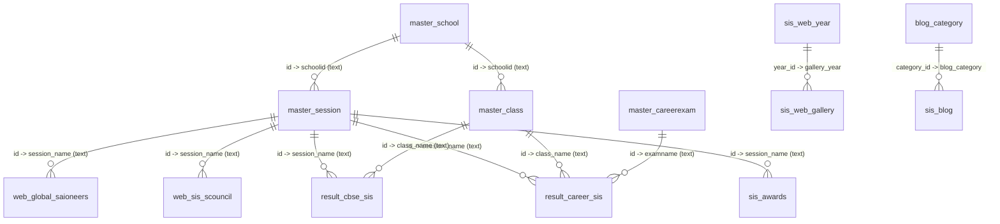

# Database Documentation

This backend reads a MariaDB (MySQL-compatible) ERP database through Kysely. The TypeScript contract lives in `src/core/database/schema.ts`, table names are centralized in `src/common/enums/database.enum.ts`, and the connection is created in `src/core/database/db.ts` and `src/core/database/database.module.ts`.

Everything below was verified by introspecting the live database (`information_schema` plus sample rows) on 2026-08-18, with the API running on `http://127.0.0.1:3001`.

## Connection

| Setting | Source | Live value |
| --- | --- | --- |
| Host | `DB_HOST` | Remote ERP host (see `.env`) |
| User | `DB_USER` | `erpschool-dpd` |
| Password | `DB_PASSWORD` | — |
| Database | `DB_NAME` | `erpschool` |
| Port | `DB_PORT` | `3306` (code default when unset) |
| Pool size | code | `connectionLimit: 10` |

| Server fact | Value |
| --- | --- |
| Server version | `10.11.18-MariaDB-cll-lve` |
| Database charset / collation | `latin1` / `latin1_swedish_ci` |
| Tables in `erpschool` | 60 (14 used by this API) |
| Foreign keys declared | none, anywhere in the schema |
| Indexes on API tables | primary key only — no secondary indexes exist |

The database is shared with a wider ERP/LMS product. This backend is read-only against it: every query in `src/modules/**` is a `selectFrom`, and no migrations are owned by this repo.

Table collations are mixed — older ERP tables are `latin1_swedish_ci`, newer web-content tables are `utf8mb4_general_ci` (`blog_category`, `sis_blog`, `sis_web_gallery`, `sis_web_year`, `master_careerexam`, `master_house`, `master_section`). Cross-collation joins between these families are one reason the services cast join keys to `CHAR`.

## Conventions Confirmed In Live Data

| Convention | What the data actually shows |
| --- | --- |
| `status = 1` | Active/published. In practice almost every row is `1`: all 684 career results, all 42 awards, all 95 press releases. `sis_blog` has one row at `2`, and `sis_web_year` has 18 rows at `2` versus 1 at `1`. |
| `session_name` on content tables | Stores a `master_session.id` as text (`"18"`, `"19"`), not the label. The readable label (`2025-2026`) lives in `master_session.session_name`. Joins cast both sides to `CHAR`. Zero orphan session references in `result_career_sis`. |
| `class_name` on result tables | Stores a `master_class.id` as text (`"10"`–`"13"` in career results). Services fall back to the raw value if no class row matches. |
| `examname` on `result_career_sis` | Stores a `master_careerexam.id` as text (`"1"`–`"9"`). |
| `schoolid` | Text school id: `1` = SAI Angan, `2` = SAI International School, `3` = SAI International Residential School. |
| Profile / thumbnail images | Filenames only, not URLs — e.g. `1814374060_14107.JPG`, `1522624945_532886688_green school.jpeg`. The consuming frontend prefixes the host path. |
| Gallery / blog photos | `gallery_photo_path` and `blog_photo_path` hold the directory (`uploads/gallery/2026/04/15/129/`); `gallery_photo` and `blog_photo` hold a comma-separated filename list (`1.jpg,2.jpg,3.jpg`) capped at `varchar(2555)`. |
| Timestamps | Older ERP tables use `entrydate` / `updatedate` (`datetime`); newer web tables use `created_on` (`datetime`, `NOT NULL` with no default). |
| Nullability | Every column except the auto-increment primary keys and the three `created_on` columns is `NULL`-able in the live database, regardless of what the TypeScript interface says. |

## Multi-School Scoping

`master_session`, `master_class` and `master_careerexam` each carry a `schoolid`, and session/class ids are school-specific (e.g. session `18` belongs to school `2`, session `21` to school `3`). Every endpoint that reads one of these master tables therefore accepts an optional `schoolId` query parameter:

- The filter is applied **inside the join condition** on the master table, not as a `WHERE` on the joined table. On the `LEFT JOIN`s in `CareerResultsService` this matters — a `WHERE` there would silently turn the join into an inner join and drop the fallback rows.
- `result_career_sis` is the only content table with its own `schoolid`; it is filtered directly in the `WHERE` clause, which is what actually excludes other schools' result rows.
- The other content tables (`sis_awards`, `result_cbse_sis`, `web_sis_scouncil`, `web_global_saioneers`) have no school column. They are scoped transitively: their `INNER JOIN` to a school-filtered `master_session` excludes other schools' rows.
- Omitted `schoolId` falls back to `DEFAULT_SCHOOL_ID` (env), then to `2`. See `src/common/utils/school.util.ts`.
- Content for school `3` (SIRS) lives in `result_cbse_sirs` / `web_sirs_scouncil`, which are not wired into `Tables` yet — so `schoolId=3` currently returns empty arrays from the SIS endpoints.

## Relationship Map

No foreign keys exist; these are the joins the application performs.

## Tables Used By This API

Row counts are live counts taken on 2026-08-18.

| Table | Purpose | Primary key | Rows | Collation |
| --- | --- | --- | --- | --- |
| `master_school` | School master | `id` | 3 | latin1 |
| `master_session` | Academic session master | `id` | 28 | latin1 |
| `master_class` | Class master | `id` | 37 | latin1 |
| `master_careerexam` | Career exam master | `id` | 9 | utf8mb4 |
| `sis_awards` | Award content | `id` | 42 | latin1 |
| `result_cbse_sis` | CBSE/academic results | `id` | 2,191 | latin1 |
| `result_career_sis` | Career exam results | `id` | 684 | latin1 |
| `web_sis_scouncil` | Student council | `id` | 357 | latin1 |
| `web_global_saioneers` | Global Sioneers | `id` | 125 | latin1 |
| `web_sis_pressrelease` | Press releases | `id` | 95 | latin1 |
| `sis_web_gallery` | Gallery albums | `gallery_id` | 128 | utf8mb4 |
| `sis_web_year` | Gallery year lookup | `year_id` | 19 | utf8mb4 |
| `sis_blog` | Blog content | `blog_id` | 722 | utf8mb4 |
| `blog_category` | Blog category lookup | `category_id` | 3 | utf8mb4 |

## Master Tables

### `master_school` — 3 rows

| Column | SQL type | Null | Notes |
| --- | --- | --- | --- |
| `id` | `int(11)` AI | No | PK |
| `school_name` | `longtext` | Yes | `SAI Angan`, `SAI International School`, `SAI International Residential School` |
| `school_address` | `longtext` | Yes | |
| `status` | `varchar(10)` | Yes | Stored as the string `"1"`, not an int |
| `logofile` | `varchar(100)` | Yes | **Not in the TypeScript interface** (`sai.png`, `sirs.png`, `saiangan.png`) |

### `master_session` — 28 rows

| Column | SQL type | Null | Notes |
| --- | --- | --- | --- |
| `id` | `int(11)` AI | No | PK. Referenced as text by every content table |
| `session_name` | `varchar(100)` | Yes | Display label, e.g. `2025-2026` |
| `session_startdate` | `date` | Yes | |
| `session_enddate` | `date` | Yes | Year filters use `YEAR(session_enddate)` |
| `schoolid` | `varchar(100)` | Yes | `2` for ids 1–19, `3` for ids 20–28 |
| `active_session` | `varchar(10)` | Yes | **Not in the TypeScript interface**; currently `NULL` on every row |
| `status` | `int(2)` | Yes | All 28 rows are `1` |
| `entrydate` | `datetime` | Yes | |
| `updatedate` | `datetime` | Yes | |

Ids 1–19 cover `2008-2009` through `2026-2027` for school `2`; ids 20–28 repeat `2018-2019`–`2026-2027` for school `3` (SIRS). Labels therefore repeat across schools, so filter by id, not label.

### `master_class` — 37 rows

| Column | SQL type | Null | Notes |
| --- | --- | --- | --- |
| `id` | `int(11)` AI | No | PK |
| `class_name` | `varchar(100)` | Yes | `Class IV` … `Class XII IBCP` |
| `icard_name` | `varchar(50)` | Yes | **Not in the TypeScript interface** |
| `il_name` | `varchar(100)` | Yes | ERP metadata |
| `cil_name` | `varchar(100)` | Yes | ERP metadata |
| `principal_name` | `varchar(100)` | Yes | |
| `boardid` | `varchar(50)` | Yes | |
| `schoolid` | `varchar(100)` | Yes | ids 1–20 → school `2`, 21–24 → school `1`, 25–37 → school `3` |
| `status` | `int(2)` | Yes | |
| `entrydate` | `datetime` | Yes | |
| `updatedate` | `datetime` | Yes | |
| `sorting` | `int(11)` | Yes | **Not in the TypeScript interface**; display order |

### `master_careerexam` — 9 rows

| Column | SQL type | Null | Notes |
| --- | --- | --- | --- |
| `id` | `int(11)` AI | No | PK |
| `career_exam_name` | `varchar(100)` | Yes | `JEE Mains`, `NEET`, `JEE Advanced`, `CLAT`, `CA Qualifiers`, `CA Foundation`, `KVPY`, `NTSE`, `Delhi University` |
| `schoolid` | `int(11)` | Yes | **Not in the TypeScript interface**; `2` on every row |
| `status` | `int(11)` | Yes | All `1` |
| `entrydate` | `datetime` | Yes | |
| `updatedate` | `datetime` | Yes | |

This is the lookup behind `GET /career-results/exams`.

## Content And Result Tables

### `sis_awards` — 42 rows

| Column | SQL type | Null | Notes |
| --- | --- | --- | --- |
| `id` | `int(11)` AI | No | PK |
| `awardname` | `varchar(100)` | Yes | |
| `session_name` | `varchar(100)` | Yes | `master_session.id` as text |
| `awarddesc` | `varchar(100)` | Yes | Short description — only 100 chars available |
| `thumbnailimg` | `longtext` | Yes | Filename |
| `status` | `int(11)` | Yes | All `1` |
| `awardrecdate` | `date` | Yes | Latest-award ordering key |
| `entrydate` | `datetime` | Yes | |
| `updatedate` | `datetime` | Yes | |

Column order in the live table is `… status, awardrecdate, entrydate, updatedate`; the TypeScript interface lists `entrydate` before `awardrecdate` (harmless, Kysely selects by name).

### `result_cbse_sis` — 2,191 rows

| Column | SQL type | Null | Notes |
| --- | --- | --- | --- |
| `id` | `int(11)` AI | No | PK |
| `session_name` | `varchar(50)` | Yes | `master_session.id` as text |
| `admno` | `varchar(50)` | Yes | Admission number |
| `studname` | `varchar(250)` | Yes | |
| `class_name` | `varchar(100)` | Yes | `master_class.id` as text (e.g. `13` = Class XII Humanities) |
| `studprofilepic` | `longtext` | Yes | Filename, e.g. `254070140_14087.JPG` |
| `percentage` | `varchar(250)` | Yes | Numeric-as-text, e.g. `89.6` |
| `status` | `int(2)` | Yes | |
| `entrydate` | `datetime` | Yes | |
| `updatedate` | `datetime` | Yes | |

### `result_career_sis` — 684 rows (all active)

| Column | SQL type | Null | Notes |
| --- | --- | --- | --- |
| `id` | `int(11)` AI | No | PK |
| `session_name` | `varchar(50)` | Yes | `master_session.id` as text; values seen: `11`–`21` |
| `admno` | `varchar(50)` | Yes | |
| `studname` | `varchar(250)` | Yes | Service excludes blank names; none currently blank |
| `class_name` | `varchar(100)` | Yes | Only `10`–`13` present |
| `studprofilepic` | `longtext` | Yes | Filename |
| `examname` | `varchar(200)` | Yes | `master_careerexam.id` as text; only `1`–`9` present |
| `percentage` | `varchar(250)` | Yes | Numeric-as-text; sorted with `CAST(... AS DECIMAL(10,2))` |
| `schoolid` | `varchar(100)` | Yes | `2` on all sampled rows |
| `status` | `int(2)` | Yes | Every row is `1` |
| `entrydate` | `datetime` | Yes | |
| `updatedate` | `datetime` | Yes | |

### `web_sis_scouncil` — 357 rows

| Column | SQL type | Null | Notes |
| --- | --- | --- | --- |
| `id` | `int(11)` AI | No | PK |
| `session_name` | `varchar(50)` | Yes | `master_session.id` as text |
| `admno` | `varchar(50)` | Yes | |
| `studname` | `varchar(250)` | Yes | |
| `designation` | `varchar(100)` | Yes | e.g. `Vice House Captain (Girl) Kharavela` |
| `class_name` | `varchar(100)` | Yes | `master_class.id` as text |
| `studprofilepic` | `longtext` | Yes | |
| `status` | `int(2)` | Yes | |
| `sorting` | `int(11)` | Yes | Ascending display order |
| `entrydate` | `datetime` | Yes | |
| `updatedate` | `datetime` | Yes | |

The TypeScript interface declares a `countryname` column here. **It does not exist in the live table** — see [Schema Drift](#schema-drift-typescript-vs-live-database).

### `web_global_saioneers` — 125 rows

| Column | SQL type | Null | Notes |
| --- | --- | --- | --- |
| `id` | `int(11)` AI | No | PK |
| `session_name` | `varchar(50)` | Yes | `master_session.id` as text |
| `admno` | `varchar(50)` | Yes | |
| `studname` | `varchar(200)` | Yes | |
| `univname` | `varchar(250)` | Yes | e.g. `SP Jain School of Global Management, Singapore & Australia` |
| `studprofilepic` | `longtext` | Yes | |
| `countryname` | `varchar(250)` | Yes | Free text: `USA`, `Dubai`, `Europe`, `Singapore & Australia` |
| `status` | `int(2)` | Yes | |
| `entrydate` | `datetime` | Yes | |
| `updatedate` | `datetime` | Yes | |

### `web_sis_pressrelease` — 95 rows

| Column | SQL type | Null | Notes |
| --- | --- | --- | --- |
| `id` | `int(11)` AI | No | PK |
| `presstitle` | `varchar(100)` | Yes | |
| `pressdate` | `date` | Yes | Year filtering key |
| `presslink` | `longtext` | Yes | Frequently an empty string on recent rows |
| `pressthumbnail` | `longtext` | Yes | Filename |
| `pressimage` | `longtext` | Yes | Filename (different upload id from the thumbnail) |
| `entrydate` | `datetime` | Yes | |
| `status` | `int(11)` | Yes | |
| `updatedate` | `datetime` | Yes | |

### `sis_web_gallery` — 128 rows

| Column | SQL type | Null | Notes |
| --- | --- | --- | --- |
| `gallery_id` | `int(10)` AI | No | PK |
| `gallery_title` | `varchar(255)` | Yes | |
| `gallery_sub_title` | `varchar(255)` | Yes | |
| `gallery_thumbnail` | `varchar(255)` | Yes | Filename with an upload timestamp suffix |
| `gallery_year` | `int(10)` | Yes | → `sis_web_year.year_id`. Only `1`–`5` and `19` are in use |
| `gallery_photo_path` | `varchar(255)` | Yes | e.g. `uploads/gallery/2026/04/15/129/` |
| `gallery_photo` | `varchar(2555)` | Yes | Comma-separated filenames; **truncates silently past 2555 chars** |
| `gallery_status` | `int(10)` | Yes | All `1`; `AlbumsService` does not filter on it |
| `created_by` | `int(10)` | Yes | `0` in practice |
| `created_on` | `datetime` | No | Sort key, descending |

### `sis_web_year` — 19 rows

| Column | SQL type | Null | Notes |
| --- | --- | --- | --- |
| `year_id` | `int(10)` AI | No | PK |
| `year_title` | `varchar(255)` | Yes | `2008` … `2026`; `AlbumsService` filters albums by this string |
| `year_thumbnail` | `varchar(255)` | Yes | |
| `year_category` | `int(10)` | Yes | `1` on all rows |
| `year_photo_path` | `varchar(255)` | Yes | |
| `year_status` | `int(10)` | Yes | Only `year_id = 19` is `1`; the other 18 rows are `2` |
| `created_by` | `int(10)` | Yes | |
| `created_on` | `datetime` | No | |

`year_status` is effectively unused as an active flag here — if a future change starts filtering on `year_status = 1`, all but one year of albums would disappear.

### `sis_blog` — 722 rows

| Column | SQL type | Null | Notes |
| --- | --- | --- | --- |
| `blog_id` | `int(10)` AI | No | PK |
| `blog_title` | `varchar(255)` | Yes | |
| `blog_details` | `mediumtext` | Yes | HTML body |
| `blog_thumbnail` | `varchar(255)` | Yes | |
| `blog_banner` | `varchar(250)` | Yes | |
| `blog_category` | `int(10)` | Yes | → `blog_category.category_id` |
| `blog_photo_path` | `varchar(255)` | Yes | e.g. `uploads/blog/2026/08/14/722/` |
| `blog_photo` | `varchar(2555)` | Yes | Comma-separated filenames; `/blogs/by-id` splits this |
| `blog_status` | `int(10)` | Yes | 721 rows `1`, 1 row `2` |
| `created_by` | `int(10)` | Yes | |
| `created_on` | `datetime` | No | List sort and year-filter key |

### `blog_category` — 3 rows

| Column | SQL type | Null | Notes |
| --- | --- | --- | --- |
| `category_id` | `int(10)` AI | No | PK |
| `category_title` | `varchar(255)` | Yes | Live values are `Global Dimession` (sic), `Category-2`, `Category-3` — placeholder data; blog APIs fall back to `SAI` |
| `category_status` | `int(10)` | Yes | All `1`; not filtered by the service |
| `category_icon_path` | `varchar(1000)` | Yes | |
| `created_on` | `datetime` | Yes | |

## Schema Drift: TypeScript vs Live Database

`src/core/database/schema.ts` does not match the live tables. None of this breaks current queries — Kysely only validates the columns a query names — but the interfaces are wrong as documentation and will mislead new query code.

**Columns that exist in the database but are missing from the interfaces**

| Table | Missing column | Type |
| --- | --- | --- |
| `master_school` | `logofile` | `varchar(100)` |
| `master_session` | `active_session` | `varchar(10)` |
| `master_class` | `icard_name` | `varchar(50)` |
| `master_class` | `sorting` | `int(11)` |

`master_careerexam.schoolid` was previously missing too; it has been added to `MasterCareerExamTable` because the career-results queries now filter on it.

**Column declared in the interface but absent from the database**

| Table | Phantom column | Effect |
| --- | --- | --- |
| `web_sis_scouncil` | `countryname` | Selecting it type-checks but fails at runtime with `Unknown column`. `StudentCouncilService` never selects it, so nothing breaks today. |

**Nullability**

Every non-PK column in these 14 tables is nullable in the database, but `MasterSchoolTable`, `MasterClassTable`, `SisAwardsTable`, `ResultCbseSisTable`, `WebSisPressreleaseTable`, `WebSisScouncilTable`, `WebGlobalSaioneersTable`, `SisWebGalleryTable`, `SisBlogsTable` and `SisBlogCategoryTable` declare most fields non-null. Only `ResultCareerSisTable`, `MasterSessionTable`, `MasterCareerExamTable` and `SisWebYearTable` reflect reality. Code that trusts the non-null declarations can receive `null` at runtime.

**Type mismatch**

`master_school.status` is `varchar(10)` in the database and `string` in the interface — correct — but every other `status` column is an integer. Do not compare `master_school.status` to a number.

## Other Tables In `erpschool`

The database serves the wider ERP/LMS product; 46 of the 60 tables are outside this API's scope and are not in `schema.ts`. Two of them mirror tables this API already models, for the SIRS school:

| Table | Rows | Relationship |
| --- | --- | --- |
| `result_cbse_sirs` | 316 | Same 10 columns as `result_cbse_sis`, all nullable except `id`. SIRS equivalent. |
| `web_sirs_scouncil` | 224 | Same as `web_sis_scouncil` (11 columns, no `countryname`). SIRS equivalent. |
| `result_cbse_import_sis` | 2 | Staging table for result imports. |
| `cbse_result_class12` | 565 | Older/parallel result table. |

The remaining tables, grouped:

- **Students & staff**: `app_users` (19,469), `sis_studentprofile` (4,176), `sis_studentprofile_scan`, `employees` (572), `employees_assign`, `sis_teacher_class`, `icard_files`, `sis_docket`
- **Masters**: `master_board`, `master_house`, `master_section`, `master_subject`, `master_subjecttype`, `master_levels`, `master_skill`, `master_empdesignation`, `master_usertype`, `master_login`, `master_menu`, `user_menu`, `master_crmstatus`
- **LMS**: `master_lms_courses` (2,228), `master_lms_chapter` (2,541), `master_lms_files` (22,842), `master_lms_course_content_attribute`, `milestone_topic`, `milestone_chapter`, `milestone_subtopic`, `milestone_periods`, `periods_content`, `periods_notes`, `periods_mcq`, `periods_questions`, `qb_section`
- **Events**: `event_qrcode` (363,268), `event_qrcode_transaction`, `event_eventname`, `event_eventdate_data`, `event_stallusers`
- **CRM / inventory**: `crm_lead`, `inv_category`, `inv_vendor`

Switching any endpoint to a SIRS table requires a new interface in `schema.ts` and a new entry in `Tables` first — the enum currently only names SIS tables.

## API Usage By Table

| Table | Used by |
| --- | --- |
| `sis_awards` | `AwardsService`; `SessionsService` for the `awards` scope |
| `result_cbse_sis` | `ResultsService`; `SessionsService` for the `results` scope |
| `result_career_sis` | `CareerResultsService`; `SessionsService` for the `career-results` scope |
| `master_careerexam` | `CareerResultsService` (`GET /career-results/exams`) |
| `web_sis_scouncil` | `StudentCouncilService` |
| `web_global_saioneers` | `SioneersService`; `SessionsService` for the `global-sioneers` scope |
| `web_sis_pressrelease` | `PressReleasesService` |
| `sis_web_gallery`, `sis_web_year` | `AlbumsService` (inner join on `gallery_year = year_id`) |
| `sis_blog`, `blog_category` | `BlogsService` |
| `master_session` | Awards, results, career results, Sioneers, student council, session filters |
| `master_class` | Results and career results |
| `master_school` | In `schema.ts`; no service reads it |

## Maintenance Notes

- Adding a table means updating both `src/core/database/schema.ts` and `src/common/enums/database.enum.ts`.
- Keep interface nullability aligned with the database: in this schema that means nearly everything except primary keys is nullable.
- Never assume a `*_name` column holds a name. `session_name`, `class_name` and `examname` on content tables hold numeric ids as text; join through the master table and keep the raw value as a fallback.
- Joins between latin1 and utf8mb4 tables need explicit `CAST(... AS CHAR)` on both sides, which is what the existing services do.
- No indexes exist beyond the primary keys, so every filter is a full scan. Current table sizes (largest API table ~2k rows) make that fine; adding an index on `result_cbse_sis.session_name` or `sis_blog.created_on` would be the first move if a table grows.
- Query with the injected `"DB"` provider from `DatabaseModule` in services. The module-level `db` singleton in `src/core/database/db.ts` reads `process.env` directly and logs credentials to stdout on import.
